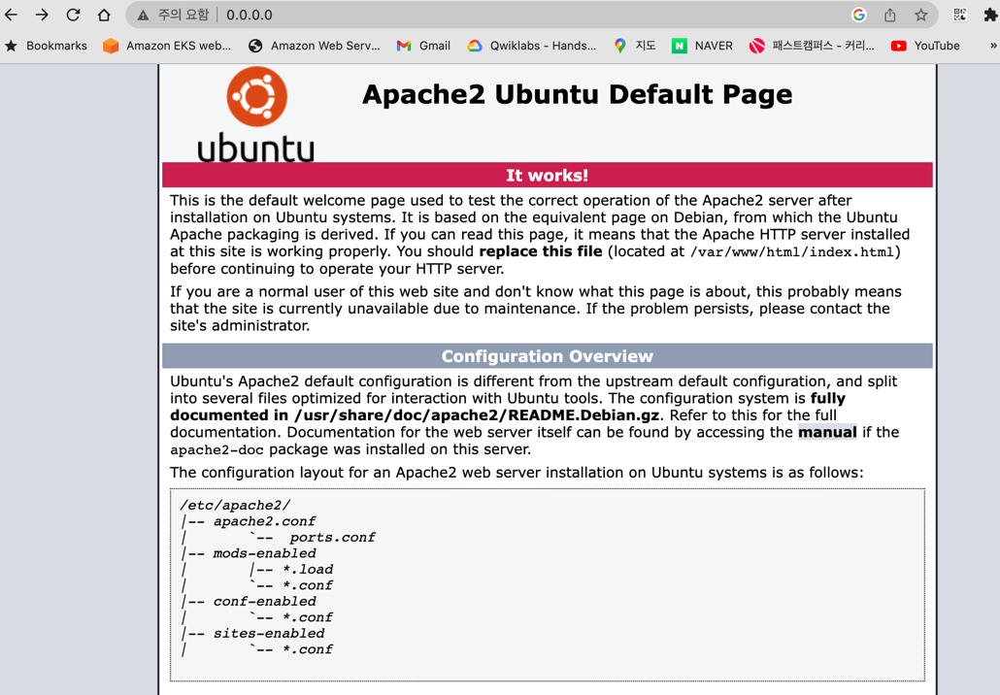
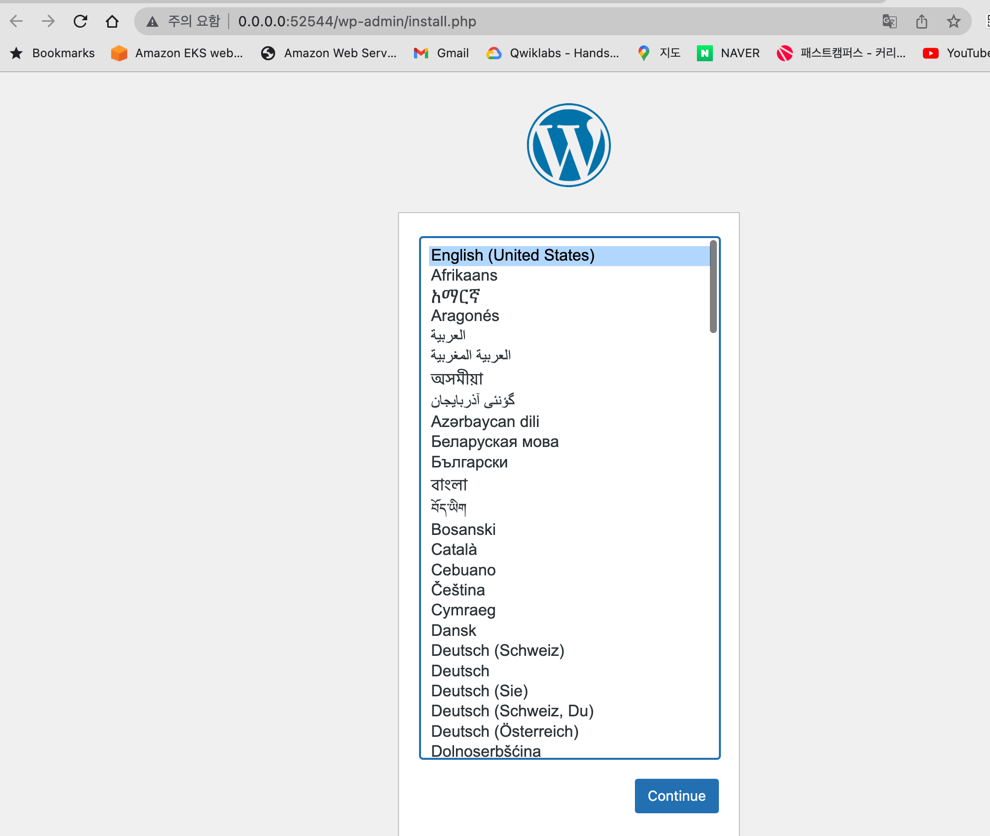

## 도커 , 쿠버네티스 실습
### 도커 실습
- [도커사용법 기본](https://github.com/cnaps/learningspoons/blob/main/dockeredu/docker1.md)
- [켄테이너 외부 접속](https://github.com/cnaps/learningspoons/blob/main/dockeredu/docker2.md)
- [이미지 생성 ,저장소 push,도커파일](https://github.com/cnaps/learningspoons/blob/main/dockeredu/docker3.md)
### 쿠버네티스 실습
- [파드,디플로이먼트,서비스,레플리카](https://github.com/cnaps/learningspoons/blob/main/k8sedu/podservice/pod.md)
- [인그레스](https://github.com/cnaps/learningspoons/blob/main/k8sedu/ingress/ingress.md)

### 사전 준비사항
- Docker Desktop 설치 https://docs.docker.com/desktop/mac/install/ .

  
### Docker 실습1 - 외부 접속   
- 컨테이너를 외부에 노출해 보자. 컨테이너 포트와 로컬 포트 바인딩
```
docker run -i -t --name mywebserver -p 80:80  ubuntu:14.04
root@eed326df35a1:/#
``` 

- 컨테이너에 내부에 웹서버 설치하고 외부에서 접속
```
docker run -i -t --name mywebserver -p 80:80  ubuntu:14.04
root@eed326df35a1:/# apt-get update
root@eed326df35a1:/# apt-get install apache2 -y
root@eed326df35a1:/# servcie apache2 start
```
- docker ps 명령어로 호스트의 포트와 컨테이너 연결 포트 확인
```
  docker ps
CONTAINER ID   IMAGE          COMMAND                   CREATED          STATUS          PORTS                   NAMES
eed326df35a1   ubuntu:14.04   "/bin/bash"               52 minutes ago   Up 42 minutes   0.0.0.0:80->80/tcp      mywebserver
```
- 브라우저에서 0.0.0.0:80 포트로 확인하면 컨테이너에서 실행되는 아파치 웹서버 확인 가능


### ocker 실습2 : 어플리케이션, DB 생성하여 외부 접속

- 2개의 컨테이너 어플리케이션 과 데이터베이스 설치 후 외부에서 접속 
- db 서버 컨테이너 와 어플리케이션 서버 컨테이너를 생성 실행 
- 
- mysql 데이터베이스 생성

```
docker run -d \
> --name wordpressdb \
> -e MYSQL_ROOT_PASSWORD=password \
> -e MYSQL_DATABASE=wordpress \
> mysql:5.7
```

- 워드 프레스 어플리케이션 생성
```
docker rnd -d \
> -e WORDPRESS_DB_HOST=mysql \
> -e WORDPRESS_DB_USER=root \
> -e WORDPRESS_DB_PASSWORD=password \
> --name wordpress \
> --link wordpressdb:mysql \
> -p 80 \
> wordpress
```
- 외부 전속하기 , docker ps 로 확인
```
> docker ps
CONTAINER ID   IMAGE          COMMAND                   CREATED          STATUS          PORTS                   NAMES
1257b1020792   wordpress      "docker-entrypoint.s…"   27 seconds ago   Up 26 seconds   0.0.0.0:52544->80/tcp   wordpress
89512d7e9047   mysql:5.7      "docker-entrypoint.s…"   3 minutes ago    Up 3 minutes    3306/tcp, 33060/tcp     wordpressdb
```
- 브라우저에서 http://0.0.0.0:52544 로 접근해 보자.


- 기타 유용한 docker 명령어
- 도커 컨테이너 입출력 모드로 접속: docker exec -i -t 컨테이너명
- 실행중인 db컨테이너에 접속하여 mysql에 터미널로 접근해 보자
```
   docker exec -i -t wordpressdb /bin/bash
bash-4.2# mysql -u root -p
Enter password: password 입력
Welcome to the MySQL monitor.  Commands end with ; or \g.
Your MySQL connection id is 46
Server version: 5.7.42 MySQL Community Server (GPL)

Copyright (c) 2000, 2023, Oracle and/or its affiliates.

Oracle is a registered trademark of Oracle Corporation and/or its
affiliates. Other names may be trademarks of their respective
owners.

Type 'help;' or '\h' for help. Type '\c' to clear the current input statement.

mysql>
```
- docker 컨테이너 정지, 시작
```
docker stop wordpress wordpressdb
docker start wordpress wordpressdb
```

