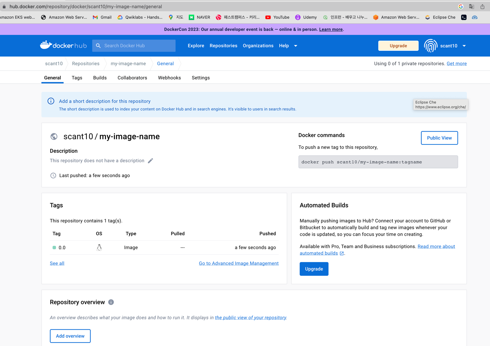
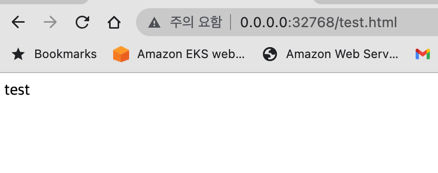
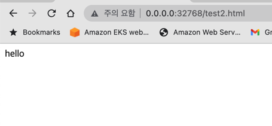

## Docker Desktop  
- Docker Desktop 설치 https://docs.docker.com/desktop/mac/install/ .


### ocker 실습3: 도커이미지 생성 ,도커 허브 저장소 push
- 도커 허브에서 이미지 검색 , 오피셜 이미지 확인
```
docker search ubuntu
``` 

- 도커 이미지를 생성해 보자. 먼저 컨테이너 생성 후 컨테이너 내부에 first라는 파일을 만들어 기존 이미지에 변경 사항을 만든다.
```
docker run -i -t --name commit_ubuntu ubuntu:14.04
root@6e2a1a475234:/# echo test_first! >> first
root@6e2a1a475234:/# ls
bin  boot  dev  etc  first  home  lib  lib64  media  mnt  opt  proc  root  run  sbin  srv  sys  tmp  usr  var
root@6e2a1a475234:/#
```
- 컨테이너를 이미지로 만들자. 다른 터미널을 띄워 우선 실행중인 컨테이너를 확인 후 아래와 같이 기입한다.
```
 docker ps
CONTAINER ID   IMAGE          COMMAND                   CREATED         STATUS          PORTS                   NAMES
6e2a1a475234   ubuntu:14.04   "/bin/bash"               2 minutes ago   Up 2 minutes                            commit_ubuntu
 docker commit \
> -a "scant" -m "my first docker image" \
> commit_ubuntu \
> commit_ubuntu:first
sha256:b16551d67447ebda238d3a63e5b04d87d30466fa332bd4b9cfc0d03cbc13e4fa
```
- docker images 명령어로 이미지 생성을 확인하자.
```
docker images
REPOSITORY       TAG     IMAGE ID       CREATED         SIZE
commit_ubuntu    first   b16551d67447   3 minutes ago   197MB
```
- 도커 이미지 삭제 명령
- 컨테이너가 존재하면 삭제할 수 없으므로 컨테이너를 삭제하고 이미지를 삭제한다.
```
docker stop commit_ubuntu && docker rm commit_ubuntu
docker rmi commit_ubuntu:first
```
### 저장소에 이미지 올리기
- 도커 컨테이너 생성하여 컨테이너 내부 진입, 파일 생성
```
 docker run -i -t --name commit_container1 ubuntu:14.04
root@bd4b93921fdf:/# echo my first push >> test
root@bd4b93921fdf:/#
```
- 위의 컨테이너를 도커 이미지로 생성하고 새로운 태그를 붙여준다.(터미널 변경)
```
 docker commit commit_container1 my-image-name:0.0
sha256:e40862fbbac5b469bfe55c888237df85e16c54c11e1cfc47c3e092b9cd1a5ba3
 docker tag my-image-name:0.0 scant10/my-image-name:0.0
```
- 태그는 같은 이미지에 다른 이륾을 붙여 주는것. 기존 이름이 사라지지 않는다.
```
 docker images
REPOSITORY        TAG   IMAGE ID       CREATED         SIZE
my-image-name     0.0  e40862fbbac5   4 minutes ago   197MB
scant10/my-image-name  0.0  e40862fbbac5   4 minutes ago   197MB
```
- 도커 허브에 로그인하여 이미지를 푸시한다. 
- 사전에 도커 허브에 로그인 하여 저장소를 만들어야 한다.
```
docker login
Authenticating with existing credentials...
Login Succeeded
Logging in with your password grants your terminal complete access to your account.
For better security, log in with a limited-privilege personal access token. Learn more at https://docs.docker.com/go/access-tokens/
 docker push scant10/my-image-name:0.0
The push refers to repository [docker.io/scant10/my-image-name]
5b547c6b7b02: Pushed
83109fa660b2: Mounted from library/ubuntu
30d3c4334a23: Mounted from library/ubuntu
f2fa9f4cf8fd: Mounted from library/ubuntu
0.0: digest: sha256:ee76156e5c48a68727587d50b8947f74fba25d2c80a81b4182e946fb8acc3e67 size: 1152
```
- 다음과 같이 푸시된 이미지를 확인할 수 있다.


### 도커 파일로 이미지 생성 
- 작업 디렉토리 생성 후 html파일 생성
- vi 에디터 오픈
```
 mkdir dockerfile && cd dockerfile
 echo test >> test.html
 ls
test.html
 vi Dockerfile
```

- vi 에디터로 dockerfile 작성한다.
```
FROM ubuntu:14.04
MAINTAINER scant10
LABEL "purpose"="pracitce"
RUN apt-get update
RUN apt-get install apache2 -y
ADD test.html /var/www/html
WORKDIR /var/www/html
RUN ["/bin/bash","-c","echo hello >> test2.html"]
EXPOSE 80
CMD apachectl -DFOREGROUND
```

- 도커파일이 생성된 것을 확인할 수 있다.
```
 ls
Dockerfile test.html
```
- 도커파일로 도커 이미지를 빌드하자.
```
 docker build -t mybuild:0.0 ./
[+] Building 0.5s (11/11) FINISHED                                                                                                docker:desktop-linux
 => [internal] load build definition from Dockerfile                                                                                              0.0s
 => => transferring dockerfile: 290B                                                                                                              0.0s
 => [internal] load .dockerignore                                                                                                                 0.0s
 => => transferring context: 2B                                                                                                                   0.0s
 => [internal] load metadata for docker.io/library/ubuntu:14.04                                                                                   0.0s
 => [1/6] FROM docker.io/library/ubuntu:14.04                                                                                                     0.0s
 => [internal] load build context                                                                                                                 0.0s
 => => transferring context: 30B                                                                                                                  0.0s
 => CACHED [2/6] RUN apt-get update                                                                                                               0.0s
 => CACHED [3/6] RUN apt-get install apache2 -y                                                                                                   0.0s
 => CACHED [4/6] ADD test.html /var/www/html                                                                                                      0.0s
 => CACHED [5/6] WORKDIR /var/www/html                                                                                                            0.0s
 => [6/6] RUN ["/bin/bash","-c","echo hello >> test2.html"]                                                                                       0.2s
 => exporting to image                                                                                                                            0.2s
 => => exporting layers                                                                                                                           0.2s
 => => writing image sha256:3d7b04b6fdffe25be3bd7c2dfd60587d1c5df0c83c729fe3363b90d6af4cafb8                                                      0.0s
 => => naming to docker.io/library/mybuild:0.0                                                                                                    0.0s

What's Next?
  View summary of image vulnerabilities and recommendations → docker scout quickview
 
```
- 생성된 도커 이미지(mybuild:0.0)로 myserver 컨테이너을 생성한다.
- 생성후 로컬호스트에 연결된 포트를 확인한다.
```
 docker run -d -P --name myserver mybuild:0.0
18e83374f6f807d76303f401da28158642b63d84221fe3321e4828407bbc0f4d
 docker port myserver
80/tcp -> 0.0.0.0:32768
```
- 연결된 로컬 호스트에 ip로 컨테이너 실행을 확인해 보자.
- http://0.0.0.0:32768/test.html 접속해 보자.
- 도커 파일로 복사한 html페이지가 실행됨을 확인할 수 있다.



- 도커 파일내에서 생성한 html페이지를 확인해 보자.
- http://0.0.0.0:32768/test2.html 접속해 보자.

