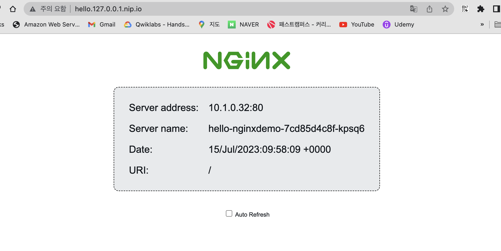

## Docker Desktop 의 Kubernetes 
- Docker Desktop 설치 https://docs.docker.com/desktop/mac/install/ .

- 환경 - 쿠버네티스 설치 : Enable Kubernets 설정
  
# Ingress 실습 1
- kubectl config 확인

``` 
  > kubectl config current-context
  docker-desktop
```
- 도커 데스크탑으로 config 변경
``` 
  > kubectl config use-context docker-desktop
  Switched to context "docker-desktop".
```
- 인그레스 컨트롤러 환경 설정 
``` 
  > kubectl apply -f https://raw.githubusercontent.com/kubernetes/ingress-nginx/controller-v1.6.4/deploy/static/provider/cloud/deploy.yaml
```
- 인그레스 컨트롤러 환경 설정이 잘 설정되었는 확인한다. 

``` 
kubectl -n ingress-nginx get pod
NAME                                        READY   STATUS      RESTARTS   AGE
ingress-nginx-admission-create-7wjh4        0/1     Completed   0          50m
ingress-nginx-admission-patch-4d299         0/1     Completed   0          50m
ingress-nginx-controller-6f79748cff-g9mq6   1/1     Running     0          50m
``` 
- hello-nginx.yaml 파일 생성
```
# Example workload for Docker Desktop getting started guide
apiVersion: v1
kind: Service
metadata:
  name: hello-nginx
  labels:
    run: hello-nginx
spec:
  ports:
  - port: 80
    protocol: TCP
    targetPort: 80
  selector:
    app: hello-nginx

---
apiVersion: apps/v1
kind: Deployment
metadata:
  name: hello-nginxdemo
spec:
  selector:
    matchLabels:
      app: hello-nginx
  replicas: 1
  template:
    metadata:
      labels:
        app: hello-nginx
    spec:
      containers:
      - name: hello-nginx
        image: nginxdemos/hello
        ports:
        - containerPort: 80
---
apiVersion: networking.k8s.io/v1
kind: Ingress
metadata:
  name: hello-ingress
  annotations:
    kubernetes.io/ingress.class: nginx
spec:
  rules:
    - host: hello.127.0.0.1.nip.io
      http:
        paths:
          - path: /
            pathType: ImplementationSpecific
            backend:
              service:
                name: hello-nginx
                port:
                  number: 80

```

- 인그레스 배포
```
kubectl apply -f hello-ingress.yaml
```
- hello 인그레스 확인 
```
kubectl get ingress
NAME              CLASS    HOSTS                    ADDRESS     PORTS   AGE
hello-ingress     <none>   hello.127.0.0.1.nip.io   localhost   80      44m
```
- 브라우저에 http://hello.127.0.0.1.nip.io 로 들어가서 라우팅 되는 모습을 확인

  

# ingress 실습 2
- apple 파드와 서비스를 생성한다. 
- apple.yaml 작성한다. apple 서비스는 apple를 반환한다. 
```
kind: Pod
apiVersion: v1
metadata:
  name: apple-app
  labels:
    app: apple
spec:
  containers:
    - name: apple-app
      image: hashicorp/http-echo
      args:
        - "-text=apple"

---

kind: Service
apiVersion: v1
metadata:
  name: apple-service
spec:
  selector:
    app: apple
  ports:
    - port: 5678 # Default port for image

```
- apple 서비스와 파드를 배포한다.
```
kubectl apply -f apple.yaml 
```


- banana 파드와 서비스를 생성한다. 
- banana.yaml 작성한다. banana 서비스는 banana를 반환한다. 

```
kind: Pod
apiVersion: v1
metadata:
  name: banana-app
  labels:
    app: banana
spec:
  containers:
    - name: banana-app
      image: hashicorp/http-echo
      args:
        - "-text=banana"

---

kind: Service
apiVersion: v1
metadata:
  name: banana-service
spec:
  selector:
    app: banana
  ports:
    - port: 5678 # Default port for image

```

- issue-ingress.yaml 생성
```
# issue-ingress.yaml
apiVersion: networking.k8s.io/v1
kind: Ingress
metadata:
  name: example-ingress
  annotations:
    kubernetes.io/ingress.class: nginx

spec:
  rules:
    - http:
        paths:
          - path: /banana
            pathType: Prefix
            backend:
              service:
                name: banana-service
                port:
                  number: 5678
          - path: /apple
            pathType: Prefix
            backend:
              service:
                name: apple-service
                port:
                  number: 5678

```
- banana 서비스와 파드를 배포한다.
```
kubectl apply -f banana.yaml 
```

- 애플과 바나나를 라우팅하는 인그레스를 생성한다.
- isuue-ingress.yaml를 작성한다.
```
# issue-ingress.yaml
apiVersion: networking.k8s.io/v1
kind: Ingress
metadata:
  name: example-ingress
  annotations:
    kubernetes.io/ingress.class: nginx

spec:
  rules:
    - http:
        paths:
          - path: /banana
            pathType: Prefix
            backend:
              service:
                name: banana-service
                port:
                  number: 5678
          - path: /apple
            pathType: Prefix
            backend:
              service:
                name: apple-service
                port:
                  number: 5678


```

- banana 서비스와 파드를 배포한다.
```
kubectl apply -f issue-ingress.yaml 
```


- issue-ingress를 테스트 한다.
```
$ curl -kL http://localhost/apple
apple

$ curl -kL http://localhost/banana
banana
```
